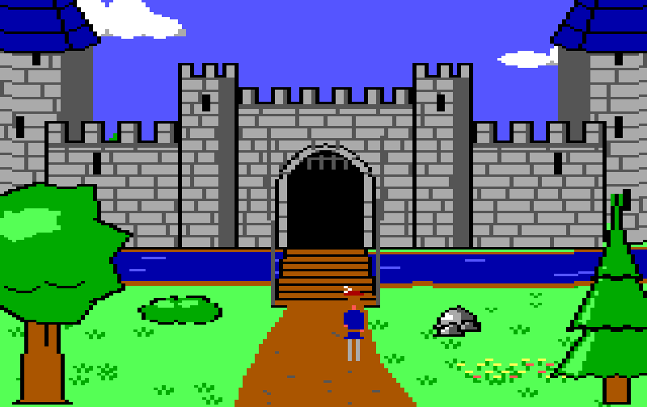
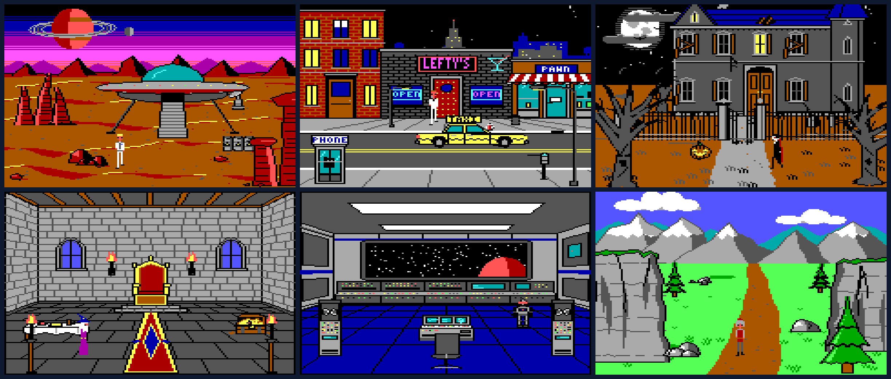
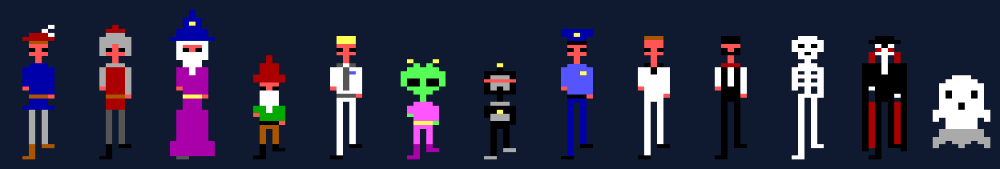

# AGIStudio Background Creator

**Paint like it's 1987.** Build Sierra-style adventure game rooms in minutes: castles, starships, neon-lit streets and haunted manors, all in glorious 16-color EGA.



> \> LOOK AT CASTLE
>
> *A mighty castle, drawn in fifteen minutes by someone who can't draw. The drawbridge is down. A path leads north.*

Remember crouching in front of a CRT, typing `OPEN DOOR` and hoping? AGIStudio Background Creator brings that look to anyone. Pick from more than a hundred ready-made pieces: skies, mountains, oak trees, castle walls, alien spires, jukeboxes, gravestones. Drag them into a room, recolor them, and nudge them until it's right. Then walk a character through the room and watch them duck behind the trees, stop at the walls and wade through the moat, just like the games you remember.

No pixel art skills required. No anti-aliasing allowed.

## Features

- 🏰 **114 ready-made elements** in five themes: Nature, Fantasy (think King's Quest), Sci-fi (Space Quest), Modern (Police Quest and Leisure Suit Larry) and Spooky. Each one has sliders and a "new variation" button, so no two trees need ever be alike.
- 🎲 **Roll a room.** One click builds a complete, sensible room in any theme.
- 🧭 **Rooms that connect.** Generate the room to the north, south, east or west, and the horizon, paths and sky line up at the shared edge.
- 🗺️ **26 hand-built starter rooms**, from a mountain pass and a throne room to a starship bridge, the street outside Lefty's and a vampire's parlor.
- 🎨 **Recolor anything.** Change each element's colors, swap colors across the whole room, or set a mood: Day, Dusk, Night, Storm, Autumn, Winter or Haunted.
- 🖌️ **Real AGI drawing tools.** Lines, step lines, flood fill and those chunky splatter-can brushes, for when you want to add your own touch.
- 🧍 **Walk your room.** Test Walk drops a character in and lets you walk around with the arrow keys, AGI-style. They slip behind things that are in front of them, bump into walls and move into the next room when they reach an edge.
- 👾 **Sprite editor** with 13 walking characters and 22 animated props (flickering torches, a spinning radar dish, a neon sign on the fritz). Recolor them, edit them, or draw your own.
- 📺 **Authentic look.** The same 160×168 pictures, wide pixels and 16 EGA colors as the originals, shown in the 4:3 shape of a real CRT.
- 📦 **Export** pictures as PNG (with an optional retro status bar and scanlines), and sprites as sheets ready for game engines like Godot or Phaser.





---

# User manual

## Getting it running

You'll need [Node.js](https://nodejs.org) installed. Then, in the project folder, run:

```bash
npm install
```

```bash
npm run dev
```

Open the web address it prints (usually `http://localhost:5173`) in your browser.

## The first five minutes

1. **Start from a ready-made room.** In the left panel, click **Rooms** and pick a starter. Or choose a theme from the dropdown and click the 🎲 dice to roll a random room.
2. **Add something.** Switch back to **Elements** and click any thumbnail to drop it into the room, or drag it to exactly where you want it.
3. **Make it yours.** Click the element in the picture. In the right panel, move the sliders, click 🎲 for a new variation, and change its colors.
4. **Walk around.** Click **Test Walk** at the top, pick a character on the right, and press the arrow keys.
5. **Show it off.** Click **Export** and download a PNG.

## The screen

- **Top bar:** the project menu (☰), your project name, the three modes (**Rooms**, **Sprites**, **Test Walk**), undo and redo, save, and **Export**.
- **Left panel:** the library of things you can add.
- **Middle:** the picture, with its toolbars above it.
- **Right panel:** settings for whatever is selected, plus the layers and rooms.

Both side panels slide away when you want more room. Click the small tab on their edge, press `[` or `]`, or press `Tab` to hide or show both. Hover over any button to see what it does.

## Rooms mode

### The library (left panel)

The library has three tabs:

- **Elements:** everything you can place, grouped into Skies, Backdrops, Ground, Water, Plants, Rocks, Structures, Room shells, Furniture and Props. Use the theme dropdown and the search box to narrow it down.
- **Rooms:** the starter rooms. Clicking one adds it to your project as a new room, with its own random variation.
- **Sprites:** characters and props to "stamp" into the picture, the way AGI games placed objects on the background.

The 🎲 dice rolls a random room in the chosen theme ("All" picks a theme for you).

### Placing and arranging

- **Click** an element in the picture to select it. **Drag** to move it.
- **Drag the small square** at its bottom-right corner to make it bigger or smaller.
- **Alt-click** to pick what's underneath, for example the grass under a tree.
- Full-width pieces like skies and ground are picked only when you click where nothing else is. Once selected, drag them up or down.
- Things nearer the bottom of the picture are "closer", so elements with **Perspective** on grow as you drag them down and shrink toward the horizon.
- Arrow keys nudge the selection one pixel (hold Shift for five). `H` flips it, and `R` rolls a new variation.

### The inspector (right panel)

When an element is selected, you can adjust:

- **Its own settings:** height, width, number of windows, open or closed doors, snow caps, lit windows. Every element has its own.
- **Variation:** the 🎲 button reshapes the element randomly while keeping its settings.
- **Position, Scale and Flip.**
- **Perspective:** whether it shrinks toward the horizon.
- **Depth:** how characters pass it (see *Depth and walls* below). **Auto** is right almost every time.
- **Walls:** turns the element's walls, doorways and water on or off.
- **Ignore mood:** keeps its original colors when the room's mood changes. Great for lit windows at night.
- **Colors:** every part of the element (leaves, trunk, roof, neon...) can be any of the 16 EGA colors.

The buttons at the top duplicate the element, delete it, or **explode** it (✂). Exploding turns it into hand-drawn strokes you can edit freely, but its sliders go away.

### Layers

Everything in a room is a layer, drawn from the bottom of the list up. Drag layers to reorder them. Use the eye to hide one and the lock to stop it being clicked by accident. The ➕ adds an empty paint layer.

### Drawing tools

The toolbar above the picture:

| Tool | What it does |
|---|---|
| Select `V` | Pick, move and resize. |
| Line `L` | Click point after point. Double-click, press Enter or right-click to finish; Esc cancels. |
| Step line `K` | Only horizontal and vertical steps, like the stair-stepped lines in the original games. |
| Fill `F` | Fills the one-color area you click. |
| Pen `B` | AGI brushes in sizes 0–7: round, square, or the classic spray pattern. |
| Pick `I` | Picks up a color from the picture. |

The color square next to the tools chooses what you paint:

- **Visual:** the picture itself.
- **Priority:** depth.
- **Control:** walls, triggers and water.

Your strokes go into the selected paint layer, or a new one if none is selected.

### Depth and walls (the secret sauce)

Classic AGI rooms are really three pictures in one. Switch between them with the buttons above the picture (or keys `1`–`4`):

- **Visual:** what the player sees.
- **Priority:** the depth map. The screen is split into horizontal bands. A character standing lower on the screen is "closer" and is drawn in front of things in higher bands, and behind things in lower ones. That's how they walk behind a tree trunk. Elements handle this for you: trees and buildings take the depth of the spot they stand on, and ground and sky take the depth of each row.
- **Control:** invisible lines that steer the character:
  - **Walls** (black) block walking.
  - **Conditional walls** (blue) block walking unless you turn them off, for gates and force fields.
  - **Triggers** (green) mark doorways and exits.
  - **Water** (cyan) is where you wade.
  - Trees, rocks and buildings come with walls along their base, and doors come with triggers.
- **Blend:** the picture and the depth map together.

The **Clear control** brush erases walls and water drawn by the layers beneath it. It's perfect for a walkway across a river.

The guide buttons show the horizon, the depth bands and a grid. The monitor button switches between the 4:3 screen shape (as players saw it) and raw pixels. The image button with a plus loads a **tracing image**, a reference photo or sketch shown over the picture that is never exported.

### Room settings

Open **Room** in the right panel to set:

- **Theme:** the style used when you generate neighboring rooms.
- **Background:** the color where nothing is drawn. AGI pictures start white.
- **Mood:** recolors the whole room: Day, Dusk, Night, Storm, Autumn, Winter or Haunted.
- **Horizon:** characters can't walk above this line.
- **Priority base:** where the depth bands begin.
- **Far scale and Near scale:** how much perspective elements shrink toward the horizon and grow toward the bottom.
- **Color swap:** replace any color with another across the whole room. Click the stamp icon to make the swap permanent.

### Rooms, neighbors and the map

The **Rooms** section lists every room in your project; click one to switch to it. Around the current room's name:

- An **arrow** goes to the room linked in that direction.
- **➕** generates a brand-new room in that direction, with a matching horizon, sky, ground and paths, linked both ways.
- A **link** icon connects to a room that's already on the map there.

Build a whole world one screen at a time, then walk through it in Test Walk.

## Sprites mode

This is where characters and animated objects live.

- **Left:** your project's sprites (➕ for a blank one) and the built-in library. Click a library sprite to add a copy to your project.
- **Middle:** the pixel editor.
  - **Tools:** Pencil `B`, Eraser `E`, Fill `F` and Pick `I`.
  - **Colors:** choose one of the 16 colors, or one of the sprite's color slots (the squares after the palette). Anything painted with a slot color can be recolored later in one click.
  - **Onion skin** shows the previous frame faintly underneath.
- **Right:** the sprite's name, animation speed and a live preview.
  - **Colors:** recolor the slots, e.g. give the knight a blue tunic.
  - **Loops:** the animations.
  - **Cels:** the frames of the selected loop. Add, duplicate, reorder or resize them.

Walking characters follow the AGI layout: loop 0 walks right, loop 1 walks left, loop 2 walks toward you and loop 3 walks away. The left loop is usually a mirror of the right one, and the mirror button turns that on or off.

To put a sprite into a picture, use the **Sprites** tab of the room library. A stamped sprite can pick its loop and frame, sit at a fixed depth, put a wall or trigger line under itself, and **animate** during Test Walk.

## Test Walk

1. Pick a character on the right. The built-in ones are one click away.
2. Press an arrow key (or W A S D) to start walking. Press the same direction again to stop, just like the originals.
3. Click anywhere in the picture to drop the character there.

The line at the top reports the character's position and depth band, plus messages like "Blocked", "Trigger", "In water" and "Entered *room name*". Walk off an edge into a linked room and you're there. The **Cond. walls** switch decides whether blue conditional walls stop you, and **Speed** sets how fast you stroll.

## Exporting

Click **Export** in the top bar.

**Pictures**
- **Which room:** the current room, or all rooms as one zip file.
- **Screen:** the visual picture, the priority (depth) map, or the control lines only.
- **Size:**
  - **Native:** 160 × 168.
  - **Wide:** 320 × 168, the doubled-width pixels the game used, and 2×, 3× and 4× versions.
  - **4:3:** the shape players actually saw, recommended for sharing.
- **Game frame:** adds an AGI-style status bar with the score and a text prompt, as a full 320 × 200 game screen.
- **Scanlines:** darkens every other row for that CRT glow.

**Sprite sheets**
- One row per loop and one column per frame, plus a data file describing every frame and animation. Many game engines, including Godot and Phaser, can import them.
- **Pixels:** 1 × 1, 2 × 1 (wide), 5 × 3 (the 4:3 screen shape), 4 × 2 or 8 × 4.

## Saving your work

Your project saves itself in the browser as you work. It will be there next time on the same computer and browser.

To keep a real copy, or move to another computer, use **Save** (☰ menu, the save icon, or `⌘S`/`Ctrl+S`). It downloads a project file. **Open** (`⌘O`/`Ctrl+O`) loads one back, and **New project** starts fresh. Browsers can clear their storage, so save a file now and then.

## Keyboard shortcuts

On Windows and Linux, use Ctrl wherever you see ⌘.

| Keys | Action |
|---|---|
| `V` `L` `K` `F` `B` `I` | Select, Line, Step line, Fill, Pen, Pick |
| `1` `2` `3` `4` | Visual, Priority, Control, Blend screens |
| `G` | Grid |
| `+` / `−` / `0` | Zoom in, zoom out, fit to window |
| `[` / `]` / `Tab` | Left panel, right panel, both panels |
| `⌘Z` / `⇧⌘Z` | Undo / redo |
| `⌘S` / `⌘O` | Save / open a project file |
| `Delete` | Delete the selected layer |
| `⌘D` | Duplicate the selected layer |
| `⌘[` / `⌘]` | Send backward / bring forward |
| `H` / `R` | Flip / new variation |
| Arrow keys | Nudge 1 pixel (Shift: 5) |
| `Esc` | Deselect, or cancel a line |
| Alt-click | Select what's underneath |
| **Sprites mode:** `B` `E` `F` `I` | Pencil, Eraser, Fill, Pick |
| **Test Walk:** arrows or `W` `A` `S` `D` | Walk; press again to stop |

## Tips and tricks

- **Big buildings go in front.** Characters never shrink with distance, just like in the originals. Keep doorways you mean to walk through toward the bottom of the screen, where they're big enough to enter.
- **Night scenes:** set the mood to Night, then turn on **Ignore mood** for anything that glows: windows, neon, candles, torches.
- **Crossing water:** the stone bridge makes its deck walkable on its own. The east–west path has a **Ford** option, and the **Clear control** brush opens up anything else.
- **Something looks too tidy?** Hit `R` a few times. Variations are free.
- **Fine-tune by hand:** explode an element (✂) to edit it stroke by stroke, or add a paint layer on top and draw over it.
- **Check your depth:** flip to the Priority screen, or take a quick Test Walk behind that tree.

---

## About

**AGIStudio Background Creator** is made by **Eric Fullerton**, who back in 2001 maintained AGIStudio under the name **Nailhead**. It's a love letter to the adventure games that taught a generation to type `GET ALL`, and a way to make new rooms in that style without drawing every pixel by hand.

*King's Quest, Space Quest, Police Quest and Leisure Suit Larry are trademarks of their respective owners. This is a fan-made tool, not affiliated with or endorsed by them. All artwork in the app is original.*
